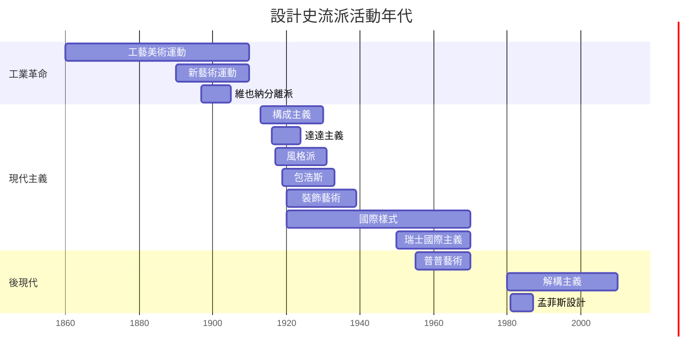

# 設計史總時間軸

> 全部已建立的流派依年代序排列。視覺化版本見 [[流派影響譜系]] 與 [[流派拼貼地圖]]。

Interactive · 互動時間軸

橫向捲動 774 年的設計史 — 上排為流派活動期間,下排為代表作品。點擊任一節點進入該筆記。

## 視覺化時間軸 (Mermaid)

## 全部流派（年代序）

| 起 | 流派 | 時代 | 地區 |
|---|---|---|---|
| 1860 | [[工藝美術運動]] | [[工業革命與設計\|工業革命]] | 英國 |
| 1890 | [[新藝術運動]] | [[工業革命與設計\|工業革命]] | 法國 / 比利時 / 西班牙 |
| 1897 | [[維也納分離派]] | [[工業革命與設計\|工業革命]] | 奧地利 |
| 1913 | [[構成主義]] | [[現代主義]] | 蘇聯 |
| 1916 | [[達達主義]] | [[現代主義]] | 瑞士 / 德國 |
| 1917 | [[風格派]] | [[現代主義]] | 荷蘭 |
| 1919 | [[包浩斯]] | [[現代主義]] | 德國 |
| 1920 | [[裝飾藝術]] | [[現代主義]] | 法國 |
| 1920s | [[國際樣式]] | [[現代主義]] | 德國 → 全球 |
| 1950s | [[瑞士國際主義]] | [[現代主義]] | 瑞士 |
| 1955 | [[普普藝術]] | [[後現代主義\|後現代]] | 美國 / 英國 |
| 1980 | [[解構主義]] | [[後現代主義\|後現代]] | 歐美 |
| 1981 | [[孟菲斯設計]] | [[後現代主義\|後現代]] | 義大利 |

## 依時代分組

### [[古代設計]]（公元前 3000 – 公元 500）

*尚未建立任何流派 — 待補充*

### [[中世紀設計]]（500 – 1400）

*尚未建立任何流派 — 待補充（拜占庭、羅馬式、哥德式等）*

### [[文藝復興設計]]（1400 – 1750）

*尚未建立任何流派 — 待補充（文藝復興、矯飾主義、巴洛克、洛可可等）*

### [[工業革命與設計]]（1750 – 1900）

- [[工藝美術運動]]（1860–）
- [[新藝術運動]]（1890–）
- [[維也納分離派]]（1897–）

### [[現代主義]]（1900 – 1960）

- [[構成主義]]（1913–）
- [[達達主義]]（1916–）
- [[風格派]]（1917–）
- [[包浩斯]]（1919–1933）
- [[裝飾藝術]]（1920–）
- [[國際樣式]]（1920s–）
- [[瑞士國際主義]]（1950s–）

### [[後現代主義]]（1960 – 1990）

- [[普普藝術]]（1955–）
- [[解構主義]]（1980–）
- [[孟菲斯設計]]（1981–）

### [[當代設計]]（1990 – ）

*流派尚未定型 — 待補充*

## 視覺化

- 📊 [[流派影響譜系]] — Excalidraw 流派之間的影響關係
- 🗺️ [[流派拼貼地圖]] — 圓形拼貼版年代地圖
