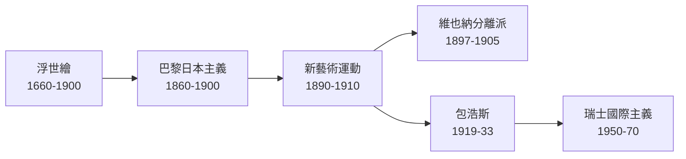
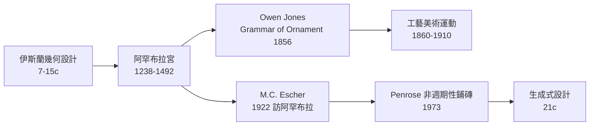

# 跨領域連結

設計史中真正有趣的部分是**影響鏈** — 某個地區的設計傳統如何被另一個地區的設計師發現、誤解、挪用、再生產。本頁整理 6 條重要的「跨領域影響鏈」,每條都跨越文化、世代、媒介。

影響鏈 1

## 浮世繪 → 新藝術 → 包浩斯

**東亞 → 歐洲 → 全球現代主義**

**具體傳遞節點**:
- 1856 莫內收藏第一張[[浮世繪]],後反覆繪製日式花園(Giverny)
- 1888 梵谷臨摹歌川廣重《大橋安宅之驟雨》— 〈Bridge in the Rain (after Hiroshige)〉
- 1895 [[慕夏]]為莎拉·伯恩哈特設計《吉斯蒙妲》海報 — 平面化構圖、強輪廓全部來自浮世繪
- 1902 [[古斯塔夫·克林姆]]《吻》— 金箔背景 + 平面構圖 = 浮世繪的維也納版
- 1911 [[包浩斯]]預備課程,Itten 色彩理論引用浮世繪
- 1957 [[Helvetica]] + [[Univers]] 純無襯線設計 — 「設計師作為訊息傳達者而非個性表演者」立場,源頭可追溯到浮世繪的匿名工匠傳統

---

影響鏈 2

## 非洲面具 → 立體派 → 達達 → 普普

**非洲傳統工藝 → 歐洲現代藝術 → 20 世紀流行視覺**

**具體傳遞節點**:
- 1907 畢卡索訪巴黎 Trocadéro 民族誌博物館看到非洲與大洋洲面具,當年完成《亞維農少女》
- 1907-09 立體派(Picasso + Braque)發展,直接源於非洲幾何簡化造型
- 1916 [[達達主義]]吸收非洲元素 — Tristan Tzara「黑人詩集」朗讀
- 1960 [[普普藝術]] Andy Warhol 等繼承「挪用大眾與民族視覺」立場
- 2020 後 BLM 運動讓「挪用 vs 致敬」變成藝術倫理核心爭議
- 加納 Adinkra 符號、肯亞 Maasai 紋樣等持續被全球時尚品牌挪用

---

影響鏈 3

## 伊斯蘭幾何 → Owen Jones → 工藝美術 → 生成式設計

**中世紀伊斯蘭數學 → 19 世紀英國設計改革 → 21 世紀演算法美學**

**具體傳遞節點**:
- 1238-1492 西班牙阿罕布拉宮完成,成為歐洲與伊斯蘭世界的視覺橋樑
- 1856 Owen Jones《The Grammar of Ornament》分章記錄埃及、希臘、羅馬、中世紀、文藝復興、阿拉伯、土耳其、波斯、印度、中國紋樣 — 第一本「全球裝飾理論」
- 1922 M.C. Escher 訪阿罕布拉,從牆面紋樣發展自己的無限鋪磚作品
- 1973 Roger Penrose 提出非週期性鋪磚;2007 物理學者發現伊斯法罕清真寺 15 世紀已有同樣模式
- 1980 後 Generative Design 興起,Islamic pattern generator 是熱門研究方向
- 2022 後 AI 生成藝術(Stable Diffusion、Midjourney)大量訓練在伊斯蘭幾何資料上

---

影響鏈 4

## 中國明朝家具 → 韋格納 → 北歐 mid-century → 當代極簡

**中國傳統工藝 → 北歐家具 → 全球現代家具語言**

**具體傳遞節點**:
- 1860 後中國家具陸續流入歐洲博物館(V&A、Pitt Rivers 等)
- 1944 [[漢斯·韋格納]] 在哥本哈根博物館看到中國明朝圈椅,設計 The Chinese Chair
- 1949 Wishbone Chair / CH24 上市,結構直接源於中國圈椅但用丹麥工藝
- 1950-60 北歐家具國際擴張,Wegner + Aalto + Jacobsen 共同把「東方溫度 + 北歐工藝」變成全球品味
- 1980 無印良品(由[[田中一光]]主導)、後續[[原研哉]]繼承這條東西方融合線
- 2010 後小米、Anker、華為等亞洲品牌設計回歸亞洲傳統 — 圍繞 mid-century 北歐家具的「圈椅」是這個迴圈的源頭

---

影響鏈 5

## 古希臘 → 文藝復興 → 新古典 → 現代主義反命題

**3000 年「古典 vs 反古典」拉鋸**

每一代設計師對「古希臘 = 永恆完美」的態度都在變,但古典柱式始終是西方設計史的隱性引力場。

---

影響鏈 6

## Xerox PARC → Macintosh → iPhone → AI 介面

**60 年「人機互動」的快速演化**

**這條鏈的特點**:
- 每個節點(20 年週期左右)都「徹底重寫」前一代的互動範式
- 第一個節點(Bush 1945)早於可實現的技術 30 年,純粹是想像
- 2007 [[iPhone]] 後 17 年,介面範式都還在「觸控 + GUI」框架內
- 2022 起對話式介面 + AI 開始挑戰這個框架,結局未明

---

為什麼跨領域連結重要

## 結語

設計史的標準敘事是「歐洲 18 世紀 → 工業革命 → 包浩斯 → 國際樣式 → 當代」,線性、單一文化、單一方向。但實際上設計影響從來不是這樣 — 它是**雙向、多向、有時延、經常被誤解的**網絡。

把這些影響鏈寫清楚,才能讓非西方設計傳統、女性設計師、被邊緣化的支流獲得歷史地位。本頁是 v1.0 的開端,持續會補完更多鏈,例如:
- 印度紡織 → Liberty 百貨 → 1960 嬉皮美學
- 蘇聯構成主義 → 1990 代後現代 → 數位介面
- 北歐功能主義 → 日本工業設計 → 21 世紀亞洲品牌

設計史不是「西方對其他地區的貢獻表」,而是「全球網絡中誰借了誰、誰改寫了誰」的長期協商。

## 相關頁面

- [[流派譜系]] — Mermaid 視覺化版的影響關係
- [[時間軸]] — 整體年代框架
- [[關於]] — 本站的編輯立場
- [[參考書目]] — 撰寫時參考的書目
