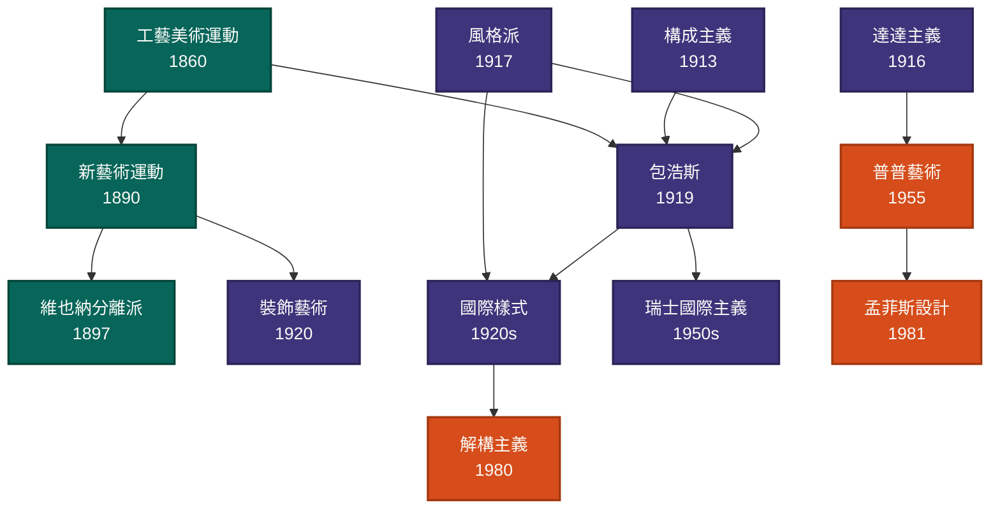

# 流派譜系

13 個設計流派依時代分組(工業革命末期 / 現代主義 / 後現代),箭頭表示主要影響方向。點任何節點直接跳到該流派詳情頁。

> **顏色分組**:深 teal = 工業革命末期 / 深紫 = 現代主義 / 橙 = 後現代

## 影響關係解讀

- **工藝美術運動 → 新藝術運動 / 包浩斯** — 莫里斯的「藝術 + 工藝整合」理念分別演化成裝飾化的新藝術與機械美學的包浩斯
- **構成主義 + 風格派 → 包浩斯** — 蘇聯的工業材料 + 荷蘭的純粹幾何,被葛羅培斯整合進包浩斯課程
- **包浩斯 → 國際樣式 / 瑞士國際主義** — 1933 包浩斯關閉後,密斯、葛羅培斯赴美,把現代主義建築美學國際化;同時瑞士分支發展網格平面設計
- **國際樣式 → 解構主義** — 1980 代蓋瑞、庫哈斯反抗國際樣式的純粹幾何,引入碎片化與斜角
- **普普藝術 → 孟菲斯設計** — 沃荷對消費文化的擁抱,被索特薩斯轉化成顛覆現代主義的家具語言
