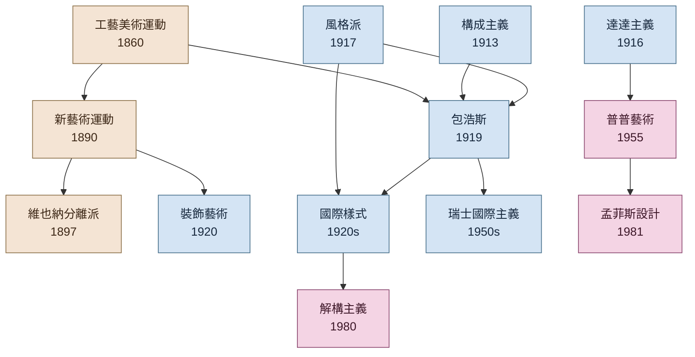

# 設計史筆記

> 一套涵蓋全時間軸、全地理範圍的設計演變視覺化筆記系統。

![[流派拼貼地圖.svg]]

## 入口

### 🕰️ 依時代瀏覽
- [[古代設計]] · [[中世紀設計]] · [[文藝復興設計]] · [[工業革命與設計]]
- [[現代主義]] · [[後現代主義]] · [[當代設計]]

### 🌏 依地區瀏覽
- [[東亞設計史]] · [[歐洲設計史]] · [[美洲設計史]] · [[其他地區設計史]]

### 🎨 依領域瀏覽
- [[平面設計史]] · [[工業設計史]] · [[建築史]]
- [[家具設計史]] · [[字體設計史]] · [[UI/UX 設計史]]

## 流派影響譜系

> 顏色分組:工業革命末期 / 現代主義 / 後現代

---

## 進一步瀏覽

- [[時間軸|完整時間軸 →]] (含 Mermaid gantt 與年代表)
- [[首頁|全站索引 →]] (流派 13 / 人物 26 / 作品 22 / 理論 2)
