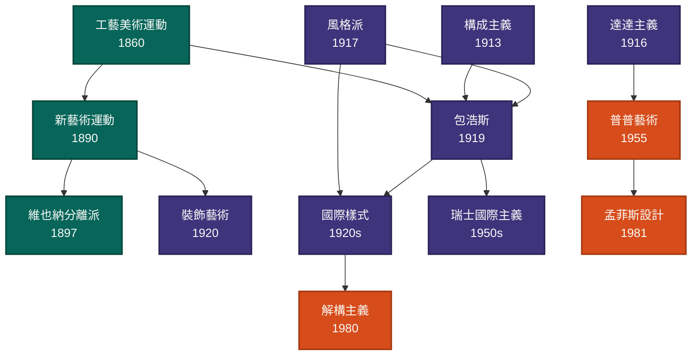

# 設計史筆記

從 1238 年的阿罕布拉宮,到 2012 年的中央電視台總部 — 一套跨越 774 年、依時代/地區/領域/流派/人物/作品交叉索引的設計演變視覺化筆記。21 流派 × 47 人物 × 34 作品 × 6 條跨領域影響鏈。

<strong>21</strong>流派

<strong>47</strong>人物

<strong>34</strong>作品

<strong>4</strong>理論

<strong>7</strong>時代

分類入口

<ul class="eye-grid">
<li><a href="40-流派"><strong>流派21</strong>古希臘 / 哥德式 / 包浩斯 / 國際樣式 / 解構主義 等</a></li>
<li><a href="50-人物"><strong>人物47</strong>莫里斯 / 葛羅培斯 / 密斯 / 柯比意 / 安藤忠雄 等</a></li>
<li><a href="60-作品"><strong>作品34</strong>阿罕布拉宮 / 紅屋 / 薩伏伊別墅 / Helvetica / iPhone 等</a></li>
<li><a href="70-理論"><strong>理論4</strong>形式追隨功能 / 裝飾與罪惡 / 有機建築 / 包浩斯宣言</a></li>
<li><a href="10-時代"><strong>時代7</strong>古代 → 中世紀 → 文藝復興 → 現代 → 當代</a></li>
<li><a href="20-地區"><strong>地區4</strong>歐洲 / 美洲 / 東亞 / 其他地區</a></li>
<li><a href="30-領域"><strong>領域6</strong>平面 / 工業 / 建築 / 家具 / 字體 / UI/UX</a></li>
<li><a href="80-視覺化"><strong>視覺化5</strong>時間軸 / 譜系 / 拼貼地圖 / 跨領域連結</a></li>
</ul>

流派影響譜系

> 顏色分組:工業革命末期 / 現代主義 / 後現代

深入探索

**視覺化**:
- [[時間軸]] — Mermaid gantt + 年代序表
- [[流派譜系]] — 13 節點可點 flowchart
- [[流派拼貼地圖|拼貼地圖]] — SVG 圓形拼貼
- [[跨領域連結]] — 6 條重要設計史影響鏈 **★ 新**

**參考**:
- [[首頁|完整全站索引]]
- [[關於|關於本站]] — 範圍、方法論、資料來源、引用方式
- [[參考書目]] — 全站書籍、論文、博物館、線上資源整理

> 持續更新中。最新進展見 [GitHub repo](https://github.com/davidsmith9-sudo/design-history) 或訂閱 [RSS](/index.xml)。
